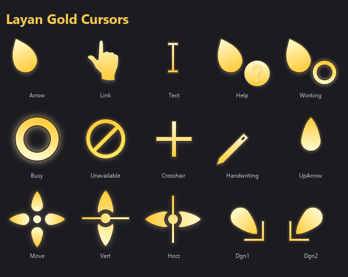

# Layan Gold cursors for Windows

A warm-gold recoloring of the [Layan cursor theme](https://github.com/vinceliuice/Layan-cursors), packaged for Windows 10/11 with HiDPI sizes (32, 40, 48, 64, 96, 128 px) and a hand-tuned dark-gold palette (v11) that holds contrast on both light and dark desktops.



## Install

1. Right-click `Install.inf` → **Install**.
2. The scheme is auto-activated. (If you don't see the change, sign out and back in.)

> The installer registers the scheme **and** writes the per-role cursor settings so it's active immediately. No need to open Mouse Properties.

## Uninstall

Right-click `uninstall.bat` → **Run as administrator** (admin recommended so the cursor files can also be cleared). The script removes the scheme registration and resets each cursor role to the Windows default. Files in `C:\Windows\Cursors\Layan Gold Cursors\` are left behind — delete that folder manually if you want them gone.

## Repo layout

```
.
├── Install.inf         ← right-click Install
├── uninstall.bat       ← right-click Run
├── *.cur / *.ani       ← 17 cursor binaries, multi-DPI, PNG inside CUR
├── preview.png         ← image above
├── README.md
├── LICENSE             ← GPL v3
├── CREDITS.md          ← upstream attribution chain
└── src/                ← build scripts & dev notes (not needed for install)
    ├── build_gold.py
    ├── morph_cursor_edge.py
    ├── verify_install.py
    ├── PATCH_IMPLEMENTATION.md
    ├── PATCH_DIFF.txt
    ├── MANUAL_SVG_EDITS.txt
    └── QUICKSTART.md
```

## Palette (v11)

| Role | Color | Notes |
|---|---|---|
| `GOLD_LIGHT` | `#FFC966` | Highlight |
| `GOLD_MID`   | `#EE9B1F` | Body |
| `GOLD_DARK`  | `#D97600` | Shadow |
| `OUTLINE`    | `#FFFFFF` | Edge stroke |

Tuned for ~1.85:1 contrast against white backgrounds and crisp outline definition at 32 px. See [`src/PATCH_IMPLEMENTATION.md`](src/PATCH_IMPLEMENTATION.md) for the design rationale.

## Sibling theme

If you like the leaf vein aesthetic, see **[Goldleaf Cursors](https://github.com/hervad/Goldleaf-Cursors)** — same family, with hand-drawn leaf veins on the pointer and busy ring.

## License

GPL v3 (see [`LICENSE`](LICENSE)). Original artwork inherits LGPL v3 from [Capitaine](https://github.com/keeferrourke/capitaine-cursors); see [`CREDITS.md`](CREDITS.md) for the full attribution chain.
