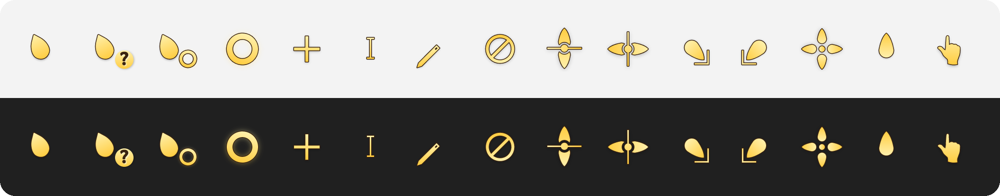

<div align="center">

# Layan Cursors (Gold) for Windows

**A warm gold edition of the Layan cursors for Windows 10 and 11, rendered natively for every display scale.**

[](https://github.com/hervad/Layan-Gold-cursors-for-Windows/releases/latest)
[](#install)
[](LICENSE)



</div>

## Install

1. **Download** `layan-gold-cursors-windows.zip` from the [latest release](https://github.com/hervad/Layan-Gold-cursors-for-Windows/releases/latest) and extract it.
2. **Right-click** `layan-gold\install.inf` and choose **Install**, then approve the administrator prompt.
   On Windows 11, **Install** is under **Show more options**.
3. **Confirm:** the installer applies **Layan Cursors (Gold)** to your account. If your cursors don't change right away, press <kbd>Win</kbd>+<kbd>R</kbd>, run `main.cpl`, open **Pointers** and click **OK**.

**Upgrading from the original release?** The installer removes the old *Layan Gold Cursors* scheme and its files, so just install over it.

## Why they stay sharp

Windows picks a cursor size in steps from your display scale, then multiplies it by the pointer size in **Settings › Accessibility › Mouse pointer and touch**. If a cursor file doesn't contain that exact size, Windows resamples the nearest one, and resampling blurs.

Every cursor is rendered from the original vector artwork at the exact sizes Windows asks for:

| Display scale | Pointer size 1 | Size 2 | Size 3 |
| --- | :-: | :-: | :-: |
| 100–149% | 32 px | 48 px | 64 px |
| 150–199% | 48 px | 72 px | 96 px |
| 200–299% | 64 px | 96 px | 128 px |
| 300–399% | 96 px | 144 px | 192 px |
| 400%+ | 128 px | 192 px | 256 px |

Every size in the table is exact for static cursors. The two animated cursors (busy and working) are exact at pointer size 1 for every display scale. Larger sizes use the next larger image. The busy ring stops at 128 px because Windows refuses animated cursors whose frames carry too much image data (see [TECHNICAL.md](TECHNICAL.md)).

**No performance cost.** Windows decodes only the image it displays, and each file is test-loaded with the Windows cursor loader at every size during the build.

## What's included

- **15 cursors:** normal, help, working in background, busy, precision, text, handwriting, unavailable, 4 resize directions, move, alternate and link. Busy and working are animated, with 23 frames at 30 fps.
- Hotspots sit exactly on the tip of each pointer.
- An installer that applies the scheme, and a one-click uninstaller.

| Palette | Color |
| --- | --- |
| Highlight | `#FFF0AB` |
| Body | `#FFCD42` |
| Outline | `#392310` |

## Uninstall

Double-click `layan-gold\uninstall.cmd` and approve the administrator prompt. If Layan Gold is your active scheme, the uninstaller switches you back to the Windows default cursors first. It then removes the files and the scheme.

If you no longer have the extracted folder, run this from an administrator terminal after switching to another scheme in `main.cpl`:

```powershell
rundll32.exe setupapi.dll,InstallHinfSection DefaultUninstall 132 C:\Windows\Cursors\Layan Cursors (Gold)\install.inf
```

## Troubleshooting

- **No "Install" option:** on Windows 11, choose **Show more options** or press <kbd>Shift</kbd>+<kbd>F10</kbd>. Extract the zip first; Windows can't install from inside it.
- **Cursors went back to Windows' own:** choosing a **Mouse pointer style** in Accessibility settings replaces the scheme. Select **Layan Cursors (Gold)** again in `main.cpl › Pointers`.
- **Some apps show other cursors:** browsers (for CSS cursors), games, and some creative tools draw their own cursors.

## Build from source

The cursors are generated from the unmodified upstream SVGs in [`src/svg`](src/svg) by [`build.py`](build.py) (Python 3.10+), which applies the gold palette, outline and help-glyph styling:

```powershell
python -m pip install -r requirements.txt
python build.py
```

This rebuilds `layan-gold\`, the release zip and `docs/preview.png`.

## Credits

The artwork is from [Layan cursors](https://github.com/vinceliuice/Layan-cursors) by vinceliuice, which is based on [Capitaine Cursors](https://github.com/keeferrourke/capitaine-cursors) by Keefer Rourke. See [CREDITS.md](CREDITS.md). Licensed under the [GNU GPL v3.0](LICENSE).
